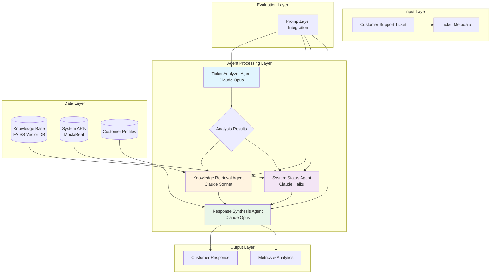
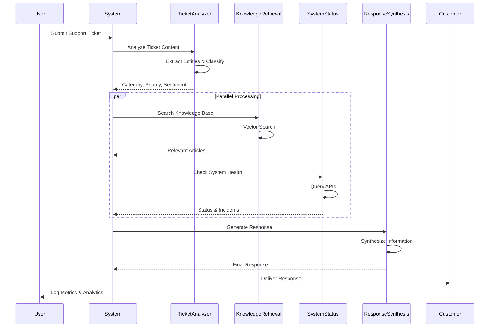

# Customer Support Ticket Resolution System

A production-ready multi-agent system that automatically processes, analyzes, and resolves customer support tickets using specialized AI agents powered by Claude.

## 🚀 Quick Start

```bash
# Clone and setup
git clone <repository-url>
cd customer-support-agent

# Configure API key
cp .env.example .env
# Edit .env and add your ANTHROPIC_API_KEY

# Run with Docker (recommended)
docker-compose up --build customer-support-agent
```

## 📋 Requirements

- **Docker & Docker Compose** (recommended) OR
- **Python 3.8+** (for local installation)
- **Anthropic API Key** (required)
- **PromptLayer API Key** (optional, for analytics)

## Overview

This system uses 4 specialized agents working together:
- **Ticket Analyzer Agent**: Extracts key information and classifies tickets
- **Knowledge Retrieval Agent**: Searches documentation and knowledge bases
- **System Status Agent**: Queries APIs for real-time system/product status
- **Response Synthesis Agent**: Generates personalized, contextual responses

## System Architecture

### High-Level Architecture



### Processing Flow



## Features

- Automated ticket classification and prioritization
- Semantic search through knowledge base articles
- Real-time system status integration
- Personalized response generation based on customer history
- Comprehensive evaluation framework with PromptLayer integration
- A/B testing capabilities for continuous improvement
- Cost tracking and optimization

## Installation

### Docker Setup (Recommended)

The easiest way to run the system is using Docker, which provides a consistent environment without requiring local Python installation.

#### Prerequisites
- Docker and Docker Compose installed on your system

#### Quick Start

1. Clone the repository:
```bash
git clone <repository-url>
cd customer-support-agent
```

2. Create your configuration:
```bash
cp .env.example .env
# Edit .env and add your ANTHROPIC_API_KEY
```

3. Run with Docker Compose:
```bash
# Build and start the application
docker-compose up --build customer-support-agent

# Or run in detached mode
docker-compose up -d customer-support-agent
```

The system will automatically:
- Install all dependencies
- Generate sample data
- Start processing tickets
- Provide health monitoring

#### Development Mode

For development with live code reloading:

```bash
# Run the development service
docker-compose --profile dev up customer-support-agent-dev

# Run specific examples
docker-compose run --rm customer-support-agent python example_usage.py
```

### Local Installation (Alternative)

If you prefer to run without Docker:

#### Quick Setup

1. Clone the repository:
```bash
git clone <repository-url>
cd customer-support-agent
```

2. Run the setup script:
```bash
python setup.py
```

3. Edit `.env` file and add your API key:
```bash
ANTHROPIC_API_KEY=your-anthropic-api-key-here
```

#### Manual Setup

1. Install dependencies:
```bash
pip install -r requirements.txt
```

2. Set up environment:
```bash
cp .env.example .env
# Edit .env with your API keys
```

3. Generate sample data:
```bash
python utils/simple_data_generator.py
```

## Quick Start

After installation, run the system:

### With Docker (Recommended)
```bash
# Process a demo ticket
docker-compose up customer-support-agent

# Run interactive examples
docker-compose run --rm customer-support-agent python example_usage.py

# Check system health
docker-compose exec customer-support-agent python health_check.py
```

### Without Docker
```bash
# Process a demo ticket
python main.py

# Run interactive examples
python example_usage.py
```

The system will use pre-generated sample data to demonstrate all features.

## Project Structure

```
customer-support-agent/
├── agents/                  # Core agent implementations
│   ├── ticket_analyzer.py   # Ticket analysis and classification
│   ├── knowledge_retrieval.py # Knowledge base search
│   ├── system_status.py     # System status checking
│   └── response_synthesis.py # Response generation
├── evaluation/              # Evaluation and metrics
│   ├── promptlayer_integration.py
│   └── metrics.py
├── data/                    # Sample data and storage
│   ├── knowledge_base/
│   ├── sample_tickets/
│   └── customer_profiles/
├── config/                  # Configuration files
│   ├── agent_configs.py
│   └── evaluation_configs.py
├── utils/                   # Utility functions
│   └── data_generator.py
└── main.py                  # Main orchestration script
```

## Usage Example

```python
from main import CustomerSupportPipeline
from agents.response_synthesis import CustomerProfile
from config.env_config import EnvConfig

# Initialize pipeline with environment configuration
env_config = EnvConfig()
config = env_config.get_pipeline_config()
pipeline = CustomerSupportPipeline(config)

# Load knowledge base
pipeline.load_knowledge_base("data/knowledge_base/articles.json")

# Process a ticket
ticket = {
    "ticket_id": "TICKET-12345",
    "subject": "Can't log into my account",
    "body": "I keep getting error E401 when trying to log in...",
    "customer_id": "CUST-67890"
}

# Optional: Load customer profile
customer_profile = CustomerProfile(
    customer_id="CUST-67890",
    name="John Doe",
    tier="premium",
    previous_tickets=5,
    satisfaction_score=4.2,
    technical_level="intermediate"
)

# Process the ticket
result = pipeline.process_ticket_sync(ticket, customer_profile)
print(result["response"]["response_text"])
```

## Agent Details

### Ticket Analyzer Agent
- Extracts: category, priority, sentiment, key issues, error codes
- Uses Claude Opus for high accuracy
- Includes escalation detection for critical issues

### Knowledge Retrieval Agent
- Implements semantic search using sentence transformers
- Returns relevant articles with solution steps
- Uses FAISS for efficient vector search

### System Status Agent
- Checks real-time system health
- Identifies ongoing incidents
- Links issues to recent deployments

### Response Synthesis Agent
- Generates contextual, empathetic responses
- Adapts tone based on customer sentiment
- Includes clear action steps

## Evaluation Framework

The system includes comprehensive evaluation metrics:

- **Classification Accuracy**: Measures correct categorization
- **Response Quality**: Tracks customer satisfaction metrics
- **Performance Metrics**: Monitors latency and throughput
- **Cost Analysis**: Calculates per-ticket processing costs

### Running Evaluations

```python
from evaluation.metrics import PerformanceMetrics, ABTestFramework

# Calculate classification metrics
predictions = ["technical", "billing", "technical"]
ground_truth = ["technical", "billing", "complaint"]
metrics = PerformanceMetrics.calculate_classification_metrics(predictions, ground_truth)

# Run A/B tests
ab_test = ABTestFramework()
ab_test.add_result("A", {"response_quality": 0.85})
ab_test.add_result("B", {"response_quality": 0.92})
significance = ab_test.calculate_significance("response_quality")
```

## Configuration

### Environment Variables

The system uses a `.env` file for configuration. See `.env.example` for all available options:

```env
# Required
ANTHROPIC_API_KEY=your-anthropic-api-key-here

# Optional
PROMPTLAYER_API_KEY=your-promptlayer-api-key-here
ENVIRONMENT=development
USE_MOCK_DATA=true
LOG_LEVEL=INFO
MAX_CONCURRENT_REQUESTS=5
RATE_LIMIT_PER_MINUTE=60
```

### Agent Configuration

Key configuration options in `config/agent_configs.py`:

- Model selection per agent
- Temperature settings
- Retry policies
- Escalation thresholds
- Quality requirements

## Docker Operations

### Common Commands

```bash
# Health check
docker-compose exec customer-support-agent python health_check.py

# View logs
docker-compose logs -f customer-support-agent

# Interactive shell
docker-compose exec customer-support-agent /bin/bash

# Regenerate sample data
docker-compose exec customer-support-agent python utils/simple_data_generator.py
```

### Troubleshooting

**Container won't start:**
```bash
# Check logs
docker-compose logs customer-support-agent

# Verify .env file
docker-compose config
```

**API key issues:**
```bash
# Test with mock data
docker-compose run --rm -e USE_MOCK_DATA=true customer-support-agent

# Verify environment
docker-compose exec customer-support-agent printenv | grep ANTHROPIC
```

**Permission errors:**
```bash
# Fix data directory
sudo chown -R $USER:$USER ./data
```

See `docker-commands.md` for a complete reference.

## Testing

### Test Suite

The system includes a comprehensive test suite with 15 diverse test cases covering various customer support scenarios:

1. **Export Feature Issue** - Professional plan user can't export data
2. **Critical Data Loss** - Database corruption with legal threats
3. **Double Billing** - Duplicate subscription charges
4. **Feature Request** - Dark mode request (positive sentiment)
5. **API Rate Limiting** - Production environment issues
6. **Pricing Inquiry** - Pre-sales questions
7. **2FA Lockout** - Authentication problems
8. **GDPR Request** - Legal compliance for data deletion
9. **Integration Failure** - Slack integration broken
10. **Positive Feedback** - Happy customer testimonial
11. **Memory Leak** - Technical deep-dive issue
12. **Accessibility** - Screen reader compatibility
13. **Cancellation Issues** - Failed subscription cancellation
14. **Sync Conflicts** - Multi-device data loss
15. **Performance Issues** - Enterprise customer complaints

### Running Test Cases with Docker

#### Method 1: Using the Shell Script (Recommended)

```bash
# Build the Docker image
./run_tests_docker.sh build

# Run all 15 test cases
./run_tests_docker.sh all

# Run a single test case (e.g., test case #2)
./run_tests_docker.sh single 2

# Run the original demo
./run_tests_docker.sh demo
```

#### Method 2: Using Docker Compose

```bash
# Run all test cases
docker-compose -f docker-compose.test.yml run --rm test-all

# Run a single test case (e.g., test case #5)
docker-compose -f docker-compose.test.yml run --rm test-single python test_single_case.py 5

# Run interactive shell for debugging
docker-compose -f docker-compose.test.yml run --rm test-interactive
```

#### Method 3: Direct Docker Commands

```bash
# Build the image
docker build -t customer-support-agent .

# Run all test cases
docker run --rm --env-file .env -v "$(pwd)/data:/app/data" customer-support-agent python test_all_cases.py

# Run single test case #3
docker run --rm --env-file .env -v "$(pwd)/data:/app/data" customer-support-agent python test_single_case.py 3
```

### Running Test Cases Locally

```bash
# Run all test cases
python test_all_cases.py

# Run a single test case (e.g., case #7)
python test_single_case.py 7

# View available test cases
python test_single_case.py
```

### Test Results

Test results are saved in:
- `data/api_responses/test_results.json` - Summary of all test cases
- `data/api_responses/test_case_X_result.json` - Individual test case results

### Mock Mode Testing

To avoid API costs during testing, set `USE_MOCK_DATA=true` in your `.env` file:

```env
USE_MOCK_DATA=true
LOG_LEVEL=DEBUG  # Optional: for detailed output
```

### Unit Tests

Run the unit test suite:
```bash
# With Docker
docker-compose run --rm customer-support-agent python -m pytest tests/

# Without Docker
python -m pytest tests/
```

## Performance Considerations

- Average processing time: ~5-10 seconds per ticket
- Supports concurrent processing for batch operations
- Knowledge base supports up to 10,000 articles efficiently
- Caching reduces repeat query costs

## Cost Optimization

- Uses different models based on complexity
- Caches frequent queries
- Batch processes when possible
- Monitors token usage per agent

## Contributing

1. Fork the repository
2. Create a feature branch
3. Add tests for new functionality
4. Submit a pull request

## License

MIT License

## Support

For issues and questions, please open a GitHub issue.